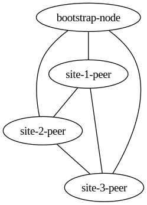

# Kad DHT Discovery

This example shows a fully peer-to-peer network negotiated using the Kademlia DHT.
A peer in the mesh will "announce" themselves to the DHT with a pre-shared key, and other peers can discover them by querying the DHT for someone advertising the same key.

## Usage

As with the other examples, you can start the compose file with:

```bash
docker-compose up
```

After a few seconds, and a lot of random WARNINGS, you should see all the nodes connect to each other.
The amount of time this takes will be dependent on the timing of the DHT discovery, and the time it takes for the nodes to connect to each other.
It shouldn't take more than 10-20 seconds.
The connections can be confirmed by executing into any of the nodes and running wg:

```bash
$ docker-compose exec site-1-peer wg
interface: webmesh0
  public key: jbDagjqI6EOslcdGlGro9dmULEKasszvQWsJwpg2wRE=
  private key: (hidden)
  listening port: 51820

peer: 0gEnrk5TTUc3yx80pk+MLhLcYYeJjsxbB5tbsKwxLAc=
  endpoint: 127.0.0.1:48754
  allowed ips: 10.100.10.4/32
  latest handshake: Now
  transfer: 852 B received, 700 B sent
  persistent keepalive: every 30 seconds

peer: dXyOh39BCX8yetKN4RT7GNM8m04BA7pY+ahSZdCrGyQ=
  endpoint: 127.0.0.1:51431
  allowed ips: 10.100.10.2/32
  latest handshake: 8 seconds ago
  transfer: 8.39 KiB received, 12.65 KiB sent
  persistent keepalive: every 30 seconds

peer: kXjKEJmAWQbAMGnILA4tl83DQzS5GdkmB0CtMHQL42g=
  endpoint: 10.40.0.1:51820
  allowed ips: 10.100.10.1/32
  latest handshake: 10 seconds ago
  transfer: 47.23 KiB received, 43.91 KiB sent
  persistent keepalive: every 30 seconds
```

All nodes request direct peerings to each other, we can query the DOT graph to see the full mesh with the wmctl utility:

```bash
# Generate a PNG of the graph
wmctl --insecure --server localhost:8443 get graph | dot -Tpng > graph.png
```

The resulting graph should look something like this:


