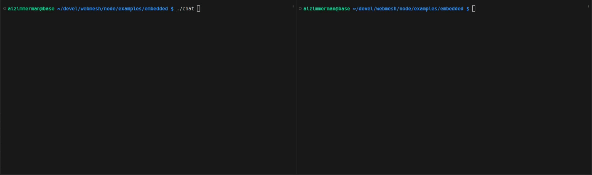

# Embedded Applications

This directory contains examples of embedded applications that use webmesh as a library.
For now, only Go examples are provided.
However, bindings for other languages are planned.

## Examples

The current example is a simple chat application between a client and server.
In reality, they are both servers, however for simplicity we let the server bootstrap the network.
The client then connects to the server and starts a bidirectional chat.

The example exists in two forms.
One using native discovery with gRPC and the other using the libp2p Kademlia DHT.

### Native Discovery

First build the binary:

```bash
go build -o chat ./mesh-chat/main.go
```

To run the example, you'll either need to be root, or you can use the `setcap` command to give the binary the following permissions:

```bash
sudo setcap cap_net_raw,cap_net_admin=eip ./chat
```

Then, you can run the server with just:

```bash
./chat
```

And the client with the join address of the server (assumed to be localhost):

```bash
./chat -join localhost:8443
```


### Kademlia DHT

Identical to the native discovery example, except you'll need to build the binary with the `mesh-chat-libp2p` binary:

```bash
go build -o chat ./mesh-chat-libp2p/main.go
```

To run the example, you'll either need to be root, or you can use the `setcap` command to give the binary the following permissions:

```bash
sudo setcap cap_net_raw,cap_net_admin=eip ./chat
```

Then, you can run the server with just:

```bash
./chat
```

The server will print out a PSK that you can use to connect to it.

```bash
./chat -psk $GENERATED_PSK
```


