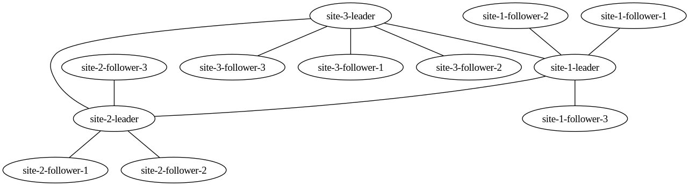

# Site-to-Site Example

This example shows three sites each with a "leader" and three "followers".
The leaders all bootstrap the mesh together, and then the followers join as spokes of their respective site leaders.

The architecture looks like the below diagram (generated with `wmctl get graph | dot -Tpng > graph.png`):

All nodes are able to communicate over the private WireGuard network.

See the [multi-bootstrap example](../multi-bootstrap/) for how to start, stop, and interact with the mesh.
